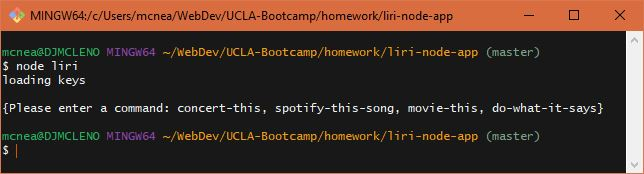
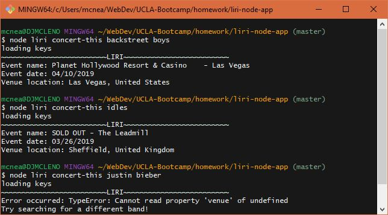
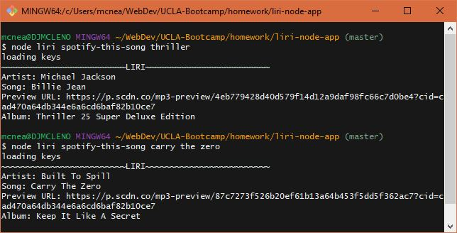
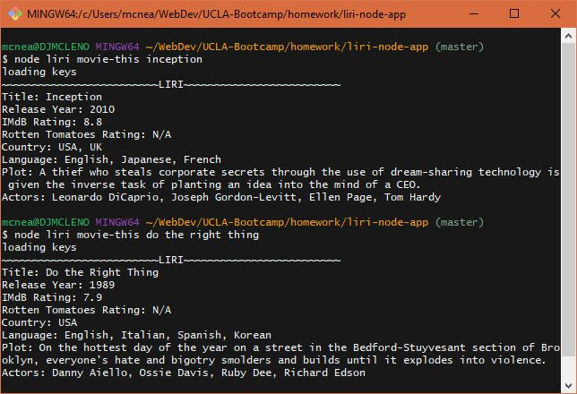
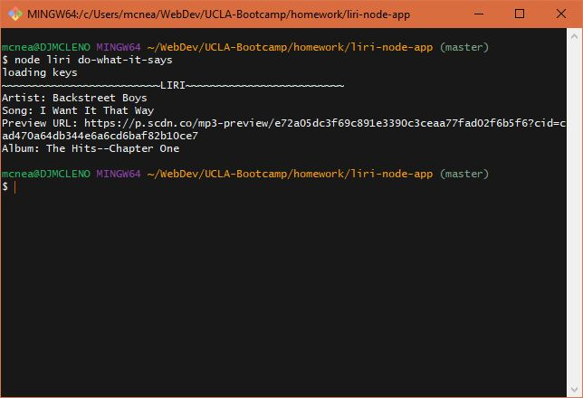

# About LIRI
LIRI is a primitive riff on Apple's SIRI, utilizing AJAX calls through axios to interact with a select number of APIs.

### Instructions:

LIRI uses a few dependencies, so please install those first by installing them in the app directory:
`npm i`

If no command is given, instructions are returned to the client.  
  

Use the "concert-this" command to query the BandsInTown API for concerts by a particular group or artist.  
  
*note*: BandsInTown will not display tour results for tickets which it cannot refer for sale. Results may vary.  

Use "spotify-this-song" to query a song title with the Spotify API.  
  

"movie-this" will query the OMDB API for relevant movie titles.  
  

Currently with limited functionality, "do-what-it-says" utilized file system interaction to read a text file & search the Spotify API.  
  

### Goals
Possible developments include:
* Additional APIs
* Better error handling
* Browser interactivity
